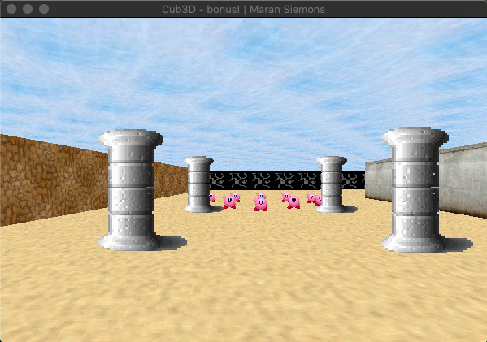
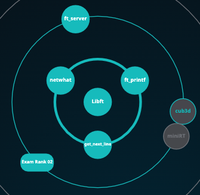

# Cub3D
<a href></a>

"This project is inspired by the world-famous eponymous 90's game, which was the first FPS ever. It will enable you to explore ray-casting. Your goal will be to make a dynamic view inside a maze from a first person perspective, in which you'll have to find your way "

This project is part of the Codam curriculum. It's a project out of the 2nd circle of the curriculum:</br>
</br>
<a href></a>

For more information check the [subject documentation](info/en.subject.cub3d.pdf)

## Bonus

Extra:
* Floor and ceiling texture
* Multiple sprites (2, 3 and 4 in the map)

## Getting Started

- Clone the repository to your computer
- Run make or make bonus
```
$ make bonus
```
- Execute program
```
./cub3D <scene_file.cub>
```

For example:
```
./cub3D maps/bonus_map.cub
```

> ! Bonus needs a different <scene_file.cub>. In the directory "maps" there is an example for the mandatory part and the bonus part.

## Scene_file.cub

The program takes as a first argument a scene description file with the .cub extension.

The map:
- N, S, E, W: player's start position and spawning orientation
- 1: wall
- 2, 3, 4 : sprites

Identifiers:
- R: resolution
- NO: path to the north side of the wall texture
- SO: path to the south side of the wall texture
- EA: path to the east side of the wall texture
- WE: path to the west side of the wall texture
- S: path to the sprite texure
- F: floor color/floor texture
- C: ceiling color/ceiling texture

## Game

Keys:
- WASD to move
- Left and right arrow key to rotate
- ESC to exit the game

Game option:
- "--save" as a second argument to save the first rendered image in bmp format

## MiniLibX
MiniLibX is an easy way to create graphical software,
without any X-Window/X11 programming knowledge under Unix/Linux, nor
any AppKit programming knowledge under MacOS. It provides
simple window creation, a drawing tool, image and basic events
management.

> ! Troubles with running the program you may need a different mlx library:
see [info/MiniLibx_sources](info/MiniLibx_sources) for the MiniLibX sources 42 has made available for this project.

## Acknowledgments and sources

* https://lodev.org/cgtutor/raycasting.html
* https://harm-smits.github.io/42docs/libs/minilibx
* https://itnext.io/bits-to-bitmaps-a-simple-walkthrough-of-bmp-image-format-765dc6857393
